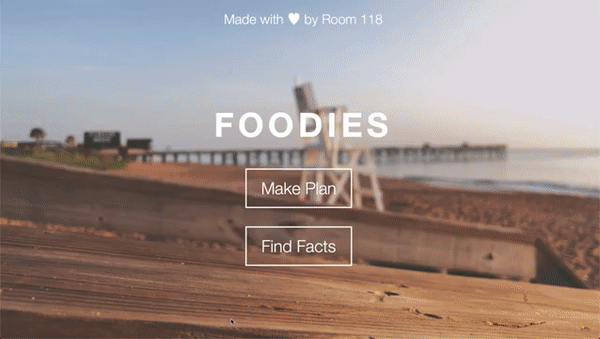

# Foodies



A Flask web application designed to process user inputs and provide a selection of meals for the day, tailored with the user in mind. Uses [spoonacular](https://spoonacular.com/food-api) to retrieve information about select meals and uses [Google Maps](https://developers.google.com/maps/documentation/javascript/tutorial) to provide locations of related restaurants.

## Configuration Process

Register for a free account on [spoonacular](https://spoonacular.com/food-api) and replace line 12 in ```app.py``` with your API key.

```python
apiKey = "spoonacular-api-key"
```

Register for a Google Cloud Developer account and replace line 14 of ```templates/locate.html``` with your API key.

```html
... &key=[GOOGLE-MAPS-API-KEY] ...
```

Now you're ready to run the application!

## Running the App

In the directory of the project:

```
. env/bin/activate
python3 app.py
```

Your app will now be running locally!
